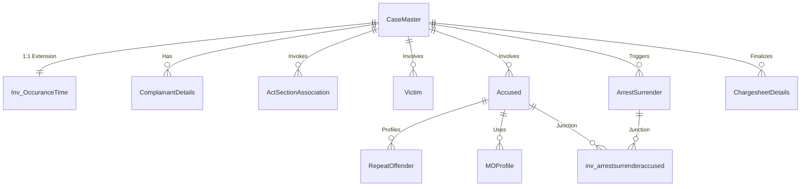

# Database Relationships

This document details the cardinality, cascade behaviors, and connection strategies between the Operational and Intelligence Layers of the Karnataka Crime Intelligence Platform (KCIP).

## Relationship Architecture

## Critical Junctions & Extensions

### 1:1 Case Details Extension
- **`CaseMaster` $\leftrightarrow$ `Inv_OccuranceTime`**: Connected via unique foreign key `CaseMasterID`. Configured with `ON DELETE CASCADE` to automatically clean up geographical details when a case is deleted.

### Many-to-Many Relationships
- **`ArrestSurrender` $\leftrightarrow$ `Accused`**: Managed via the junction table `inv_arrestsurrenderaccused` to handle multi-accused arrests.
- **`CrimeAssociation`**: Graph-based structure linking `SourceCaseMasterID` $\rightarrow$ `TargetCaseMasterID`. Enforced with a unique constraint on `(SourceCaseMasterID, TargetCaseMasterID, AssociationType)` to prevent duplicate links.

### Intelligence Layer Separation
- All intelligence tables refer to operational tables via `FOREIGN KEY` references configured with `ON DELETE SET NULL` or `ON DELETE CASCADE` to prevent operational disruptions and keep the Core operational dataset as the absolute source of truth.
